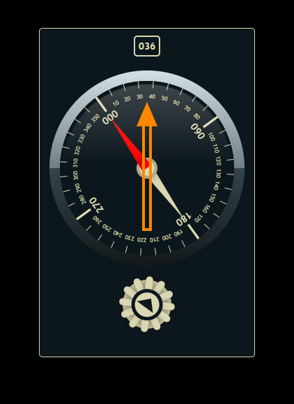

# css-rotating-compass
Heading indicator/selector with compass



Simple rotatin compass-like gauge with rotating knob. Press down mouse left button on the knob and move the pointer left or right - keep pressing mouse left button during movements. The pointer movements converted to rotation events and both the compass gauge and the knob will be rotating according to the movement's direction.
The pointer shall move LEFT or RIGTH direction hence only the X-wise movements mapped to rotating steps.

The sensitivity of the knob can be set in **HDGKnob** class statically, see the code fragment below:

```javascript
130   class HDGknob extends HDGGauge {
131       #stepmax = 4;   // how sensitive is the knob during rotation
132       ...
```

Feel free to comment, use, argue whatever! Overall enjoy your life!

-zg-
